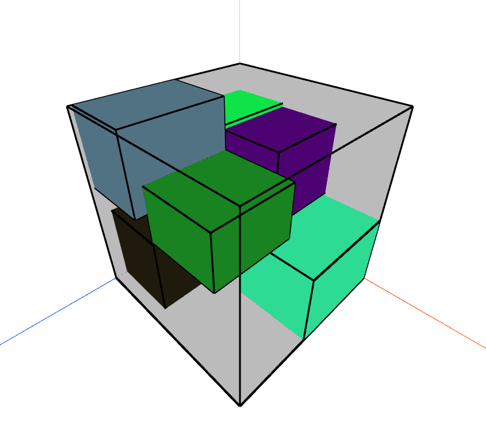

# Packing Visualizer

A simple web-based tool to visualize packing of rectangular items.

## How to Run

```sh
npm install
npx vite
```

## Examples



## Open-Source Tools

This project uses the following open-source tools:

- [three.js](https://github.com/mrdoob/three.js/) licensed under the MIT license.

