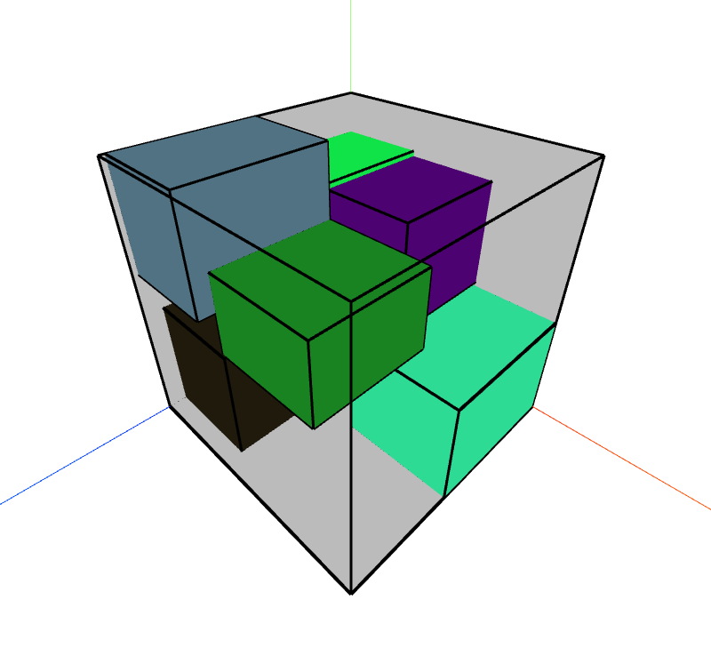

# Packing Visualizer

A simple web-based tool to visualize packing of rectangular items.

## How to Run

```sh
npm install
npx start
```

## [How to run as a static site](https://vite.dev/guide/static-deploy.html)

```sh
npm run build
npm run preview
```

## How to run with Docker

```sh
docker build --file Dockerfile --tag packing-visualizer .
docker container create --publish 5173:5173 --name packing-visualizer-app packing-visualizer
docker container start packing-visualizer-app
docker container stop packing-visualizer-app
docker container rm packing-visualizer-app
```

Now go to the [packing-visualizer local page](http://localhost:5173)

## CLI tools

```sh
npm link
check-output OUTPUT_FILE
analyse-data RESULTS_OUTPUT_DIR CSV_FILE_PATH_TO_SAVE
```

## Examples



## Open-Source Tools

This project uses the following open-source tools:

- [three.js](https://github.com/mrdoob/three.js/) licensed under the MIT license.
